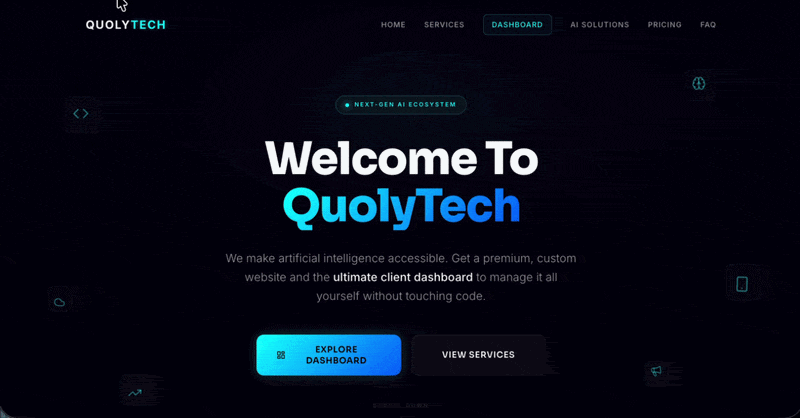

# QuolyTech

QuolyTech is a SaaS-oriented web platform concept designed to help businesses grow through modern web development, AI integrations, marketing, and self-managed website tools.

The platform is built around the idea of giving businesses a modern online presence while providing a client dashboard for managing their website and digital services without requiring direct developer involvement for every change.



## Overview

QuolyTech combines business growth services with a web management platform inspired by the flexibility of traditional CMS platforms such as WordPress.

The concept includes:

- Custom website development
- AI-powered integrations and solutions
- Website management through a client dashboard
- Analytics and performance monitoring
- Digital marketing services
- Video editing services
- Pricing and service management
- Responsive and interactive UI

The current repository focuses on the frontend experience and product presentation.

## Features

### Website Management

The dashboard concept provides businesses with a centralized interface for managing their website and viewing important information without directly modifying source code.

### AI Solutions

A dedicated section presents AI integrations that can be incorporated into business websites and workflows.

### Marketing

The platform presents digital marketing services intended to help businesses improve their online presence and reach.

### Analytics Dashboard

The dashboard UI demonstrates how website performance and business metrics could be presented to clients through a centralized interface.

### Interactive UI

The landing page uses animations, transitions, counters, parallax effects, and interactive components to create a dynamic product experience.

## Tech Stack

### Frontend

- React 19
- JavaScript
- Vite
- CSS

### Libraries

- Framer Motion
- Lucide React

### Development Tools

- ESLint
- Vite React plugin
- npm

## Project Structure

```text
src/
├── assets/
├── components/
│   ├── AnimatedCounter.jsx
│   ├── Footer.jsx
│   ├── Navbar.jsx
│   └── SpaceBackground.jsx
├── sections/
│   ├── AISolutions.jsx
│   ├── DashboardShowcase.jsx
│   ├── FAQ.jsx
│   ├── Features.jsx
│   ├── Hero.jsx
│   ├── Marketing.jsx
│   ├── Pricing.jsx
│   ├── Testimonials.jsx
│   └── VideoEditing.jsx
├── App.jsx
├── index.css
└── main.jsx


```


```md
## Getting Started

```bash
git clone https://github.com/DaveCodesWebs/saas-quoly-tech
cd quolytech
npm install
npm run dev

The app will be available at `http://localhost:5173`.

### Build

```bash
npm run build
```

